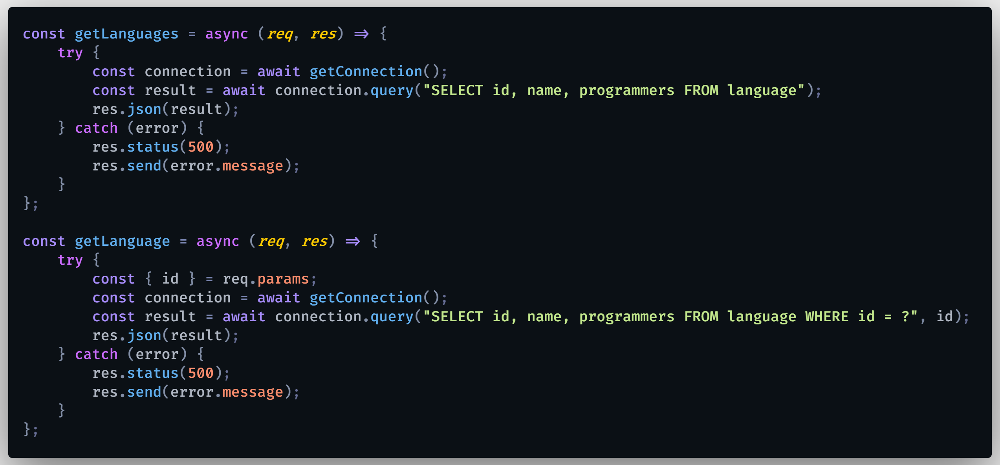

# Trabajo final REST API con Node.js, Express y MySQL utilizando los 5 verbos (GET, POST, PUT, PATCH AND DELETE)

Crear REST API usando Node.js, framework de web Express y el sistema gestor de bases de datos MySQL, con los métodos HTTP GET, POST, PUT, PATCH y DELETE; para hacerle pruebas utilicé como cliente REST Postman.

El archivo .env contiene:

### `HOST=host`
### `DATABASE=database`
### `USER=user`
### `PASSWORD=password`

Evidencias:

  

  

Atentamente: Martha Olivia Ramos Lara.
